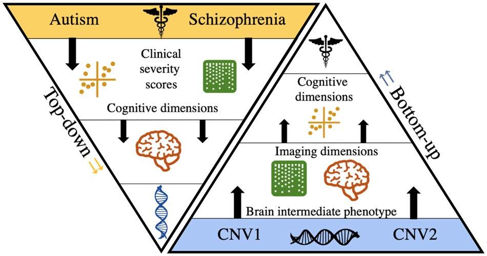
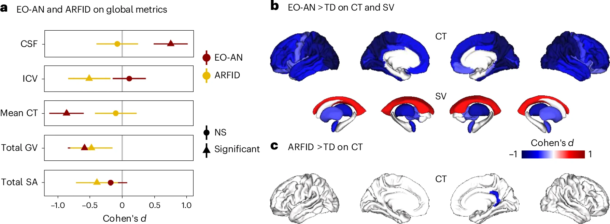

# RESEARCH FOCUS

---

## Toward a Dimensional Classification of Neurodevelopmental and Psychiatric Conditions Using Imaging and Genetics

Psychiatric research has traditionally relied on a top-down approach - comparing clinically defined diagnostic groups to controls - to identify biomarkers. However, this strategy has often produced inconsistent and non-replicable findings, largely due to the substantial heterogeneity within diagnostic categories. In clinical practice, comorbidities are the norm (e.g., ADHD frequently co-occurs with autism spectrum disorder), and clinical profiles vary widely. These challenges likely reflect the complex genetic architecture of psychiatric disorders, including pleiotropy (shared genetic variants across conditions) and polygenicity (many variants contributing to a single disorder). These observations underscore the need to rethink psychiatric nosology by shifting toward biologically grounded, dimensional approaches rather than categorical symptom-based classifications.  

Our lab adopts a bottom-up approach, starting from genetic variants associated with psychiatric conditions to investigate their impact on brain-based endophenotypes. The goal is to identify biologically meaningful dimensions that transcend traditional diagnostic boundaries. This strategy has already revealed shared functional brain alterations across psychiatric disorders—for example, thalamo-sensorimotor hyperconnectivity observed in autism, schizophrenia, and obsessive-compulsive disorder. We are currently extending this work to examine how genetic risk variants shape early brain development (e.g., in infants) and how polygenic scores influence multimodal neuroimaging and EEG features in children.  

In parallel, we also adopt a top-down, large-scale transdiagnostic perspective through international initiatives such as ENIGMA, particularly in functional neuroimaging studies aimed at identifying brain-based dimensions that cut across psychiatric and neurodevelopmental conditions.

---

## Harmonizing Analytical Methods in Functional Neuroimaging

Over the past decade, functional neuroimaging studies in psychiatry have faced a major challenge: poor reproducibility. This instability is largely driven by two factors: the heterogeneity of psychiatric diagnoses and the variability of data analysis pipelines across research teams, which can significantly alter results.  

Our lab co-leads the ENIGMA-rsfMRI working group, which focuses on harmonizing analysis pipelines for resting-state functional MRI (rs-fMRI). We develop multiverse approaches that systematically test the impact of methodological choices, such as denoising strategies, on study outcomes. This work is critical for ensuring the robustness, comparability, and translational potential of large-scale neuroimaging findings, paving the way for more reliable clinical applications in psychiatry and neurology.

---

## Brain Trajectories and Prognosis in Anorexia Nervosa

Anorexia nervosa is associated with one of the highest mortality rates among all psychiatric illnesses. This elevated risk stems from a combination of medical complications due to prolonged malnutrition and suicide, with mortality increasing by approximately 5% for each decade of illness. Typically emerging during adolescence, anorexia is characterized by severe and persistent dietary restriction, low body weight, and distorted body image. Relapse is common after weight restoration, with only ~60% of patients achieving sustained remission. Despite the severity of this condition, the neurobiological mechanisms underlying relapse and treatment response remain poorly understood.  

To address this gap, we are conducting a longitudinal study at CHU Sainte-Justine, following a cohort of patients aged 9 to 16 years at various stages of clinical care and post-hospitalization. At each time point, we collect multimodal brain imaging, along with clinical and cognitive assessments.  

Our goal is to develop predictive tools for relapse risk by examining brain recovery status after weight restoration, combined with clinical markers. Identifying early indicators of relapse could enable more personalized interventions and help prevent the transition to chronic illness. This project is part of a larger international effort that our lab co-leads through the ENIGMA Eating Disorders Working Group, which brings together over 20 research sites worldwide. Beyond its clinical implications, this study provides a unique opportunity to investigate brain plasticity and adaptation mechanisms in the context of prolonged malnutrition.
