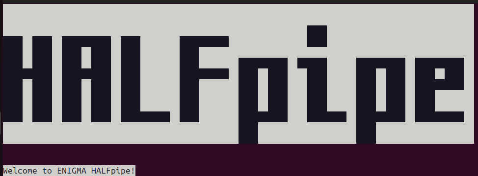

# Harmonizing Analytical Methods in Functional Neuroimaging

Over the past decade, functional neuroimaging studies in psychiatry have faced a major challenge: poor reproducibility. This instability is largely driven by two factors: the heterogeneity of psychiatric diagnoses and the variability of data analysis pipelines across research teams, which can significantly alter results.  

Our lab co-leads the ENIGMA-rsfMRI working group, which focuses on harmonizing analysis pipelines for resting-state functional MRI (rs-fMRI). We develop multiverse approaches that systematically test the impact of methodological choices, such as denoising strategies, on study outcomes. This work is critical for ensuring the robustness, comparability, and translational potential of large-scale neuroimaging findings, paving the way for more reliable clinical applications in psychiatry and neurology. 

## New website released: HALFpipe ENIGMA
As part of this project, we are collaborating with Lea Waller in the developement of [HALFpipe](https://github.com/HALFpipe/HALFpipe/tree/main) and the accompanying user manuals. 

We have contributed to the development of the HALFpipe website: https://fmri.science/halfpipe/. Manuals are free and accessible for all levels of expertise.

